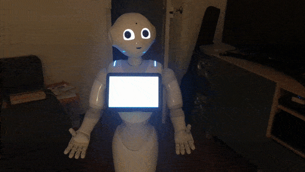

# Pepper-Home
Android app using retrofit and Softbank Robotics Europe QiSDK to communicate with the Philips Hue API from the Pepper robot.

Pepper detects the language the app is running in and runs a chat with the automatic speech recognition set to this very language, listening to trigger words (french: allume/éteint la lumière, english: turn off/on the lights) and sends a request to the Hue bridge using the retrofit API.

## Example

